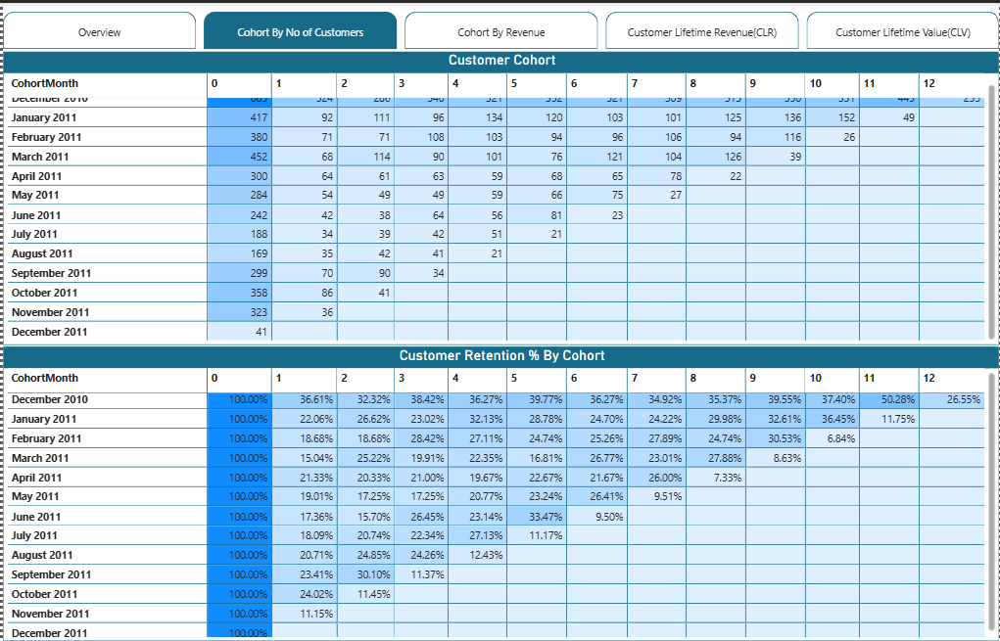

# 📊 Cohort Analysis Dashboard — Power BI

> **Uncovering customer retention patterns and revenue trends across 38 countries using advanced cohort analysis in Microsoft Power BI.**

---

## 🧠 Project Overview

This project presents an end-to-end **Cohort Analysis** built on real-world e-commerce transaction data from a UK-based online retailer. By grouping customers into cohorts based on their first purchase month, the dashboard tracks how retention, repeat purchase behaviour, and revenue evolve over time — giving stakeholders actionable insights into customer lifecycle and business health.

The analysis spans **over 536,000 transactions**, across **38 countries**, covering a **12-month period (December 2010 – December 2011)**.

---

## 🗂️ Repository Structure

```
📁 Cohort-Analysis-PowerBI/
│
├── 📊 Cohort_Analysis_Using_Power_BI.pbix   # Main Power BI dashboard file
├── 📄 Data.xlsx                              # Raw transactional dataset (536K+ rows)
└── 📖 README.md                             # Project documentation (you are here)
```

---

## 📁 Dataset — `Data.xlsx`

### Source
Real-world retail transactional data from a UK-based e-commerce business.

### Scale
| Attribute | Value |
|---|---|
| Total Records | 536,642 rows |
| Time Period | Dec 2010 – Dec 2011 |
| Countries Covered | 38 |
| Primary Market | United Kingdom |

### Schema

| Column | Type | Description |
|---|---|---|
| `InvoiceNo` | String | Unique invoice identifier (prefix `C` = cancellation) |
| `StockCode` | String | Product/item code |
| `Description` | String | Product name and description |
| `Quantity` | Integer | Number of units per transaction |
| `UnitPrice` | Float | Price per unit (GBP £) |
| `CustomerID` | Integer | Unique customer identifier |
| `Country` | String | Customer's country of residence |
| `Date` | Date | Invoice date and time |
| `Total Revenue` | Float | Derived field: `Quantity × UnitPrice` |

### Geographic Reach
The dataset covers customers across Europe, Asia-Pacific, the Americas, and the Middle East — including the UK, Germany, France, Australia, Japan, USA, UAE, and more.

---

## 📊 Power BI Dashboard — `Cohort_Analysis_Using_Power_BI.pbix`

### What is Cohort Analysis?
A **cohort** is a group of customers who share a common characteristic — in this case, their **first purchase month**. Cohort analysis tracks how these groups behave over subsequent months, answering questions like:
- What percentage of customers who first bought in January came back in February? March?
- Which acquisition cohorts have the highest long-term retention?
- How does revenue per cohort change over time?

### Dashboard Preview


### Dashboard Features

**🔹 Retention Heatmap**
A colour-coded matrix showing the percentage of customers retained month-over-month for each cohort. Darker cells indicate stronger retention — allowing instant identification of high-performing cohorts.

**🔹 Cohort Revenue Tracking**
Tracks total and average revenue generated per cohort over time, highlighting which customer groups drive the most long-term value.

**🔹 Customer Count by Cohort**
Visualises the size of each acquisition cohort, enabling comparison between periods of high and low customer acquisition.

**🔹 Monthly Trend Analysis**
Line and bar charts displaying overall revenue and transaction volume trends across the full analysis period.

**🔹 Geographic Breakdown**
Country-level filtering and visualisation to understand how retention differs across markets.

**🔹 Interactive Slicers**
Dynamic filters by country, date range, and cohort period — enabling drill-down into specific segments without leaving the dashboard.

---

## ⚙️ Tools & Technologies

| Tool | Purpose |
|---|---|
| **Microsoft Power BI Desktop** | Dashboard development and data visualisation |
| **Power Query (M Language)** | Data ingestion, transformation, and cleaning |
| **DAX (Data Analysis Expressions)** | Custom measures — cohort sizing, retention %, revenue KPIs |
| **Microsoft Excel (.xlsx)** | Raw data source |

---

## 🔄 Data Transformation & Methodology

### Key Steps in Power Query
1. **Data Cleaning** — Removed cancelled orders (InvoiceNo prefix `C`), null CustomerIDs, and zero/negative quantity entries.
2. **Date Parsing** — Extracted Year, Month, and Month-Year fields for cohort grouping.
3. **Cohort Assignment** — Identified each customer's earliest invoice date as their cohort month using `MINX` aggregation.
4. **Cohort Index Calculation** — Computed the number of months elapsed between a customer's cohort month and each subsequent purchase month.


---

## 💡 Key Insights

- **Early cohorts (Dec 2010 – Jan 2011)** show the highest long-term retention, suggesting that the earliest customers were the most loyal.
- **Month-1 retention** averages around 20–35% across cohorts — consistent with industry benchmarks for e-commerce.
- **UK customers** dominate transaction volume but international cohorts, particularly Germany and France, exhibit comparatively strong repeat-purchase rates.
- **Q4 2011** shows a significant revenue spike — likely driven by holiday season purchasing behaviour.

---

## 🚀 How to Use

1. **Clone or download** this repository.
2. Open `Data.xlsx` to explore the raw transactional data.
3. Open `Cohort_Analysis_Using_Power_BI.pbix` in **Power BI Desktop** (free download from [Microsoft](https://powerbi.microsoft.com/desktop/)).
4. If prompted, refresh the data source and point it to the local path of `Data.xlsx`.
5. Use the **slicers** on the dashboard to filter by country, cohort month, or date range.

> ⚠️ **Requires:** Power BI Desktop (latest version recommended). No paid Power BI licence needed to open and explore the `.pbix` file locally.

---

## 📈 Skills Demonstrated

- Customer segmentation and cohort methodology
- End-to-end ETL pipeline in Power Query
- Advanced DAX for time intelligence and retention metrics
- Dashboard design principles (UX, layout, colour theory for data)
- Business storytelling through data visualisation
- Working with large-scale real-world datasets (500K+ rows)

---

## 🙋 Author

**Atin Choudhary**
 [GitHub](https://github.com/AtinChoudhary06)


